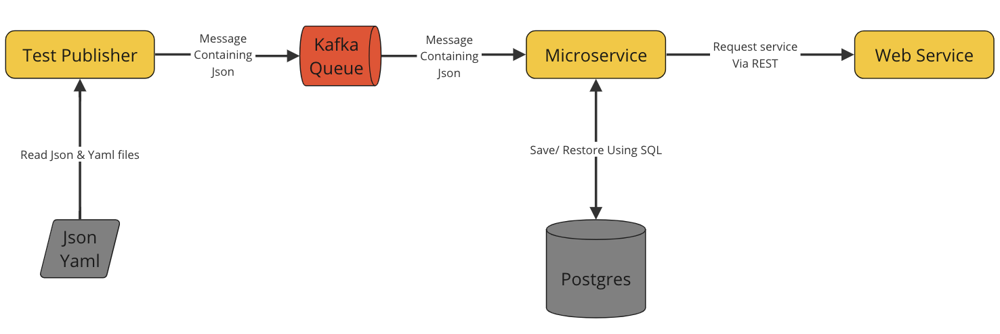

# ***Streaming Client Server***

In this project, I have created a Client Server and Micro-service architecture.

## Tech Stack

- **Python** - Version 3.11.4
- **SQL** - Postgres
- **Kafka**
- **Docker**
- **Conda**
- **DBBeaver**

## Existing Features

- Input a piece of JSON or YAML data
- A publish and subscribe model using Apache Kafka in real time
- Microservice which listens to the Kafka queue which transforms the data and saves it to Postgres. It Provides a REST 
interface to allow the web app to retrieve the data
- 

# Architecture

This application is comprised of 5 distinct pieces:

### Test Publisher

This app monitors a directory for Yaml and Json files and will publish the file contents onto a Kafka queue.
It takes two command line parameters.

    --cfg < path and filename to Kafka configuration file > 
    --dir < path to directory to monitor >

This app reads the Json and Yaml files as shown in file_reader.py:

    def read_yaml_file(file_name):
        if exists(file_name):
            with open(file_name, 'rt') as file:
                contents = yaml.safe_load(file)
                return contents
        else:
            contents = f"error {file_name} does not exist"
            print(contents)
            return contents

    def read_json_file(file_name):
        if exists(file_name):
            with open(file_name, 'rt') as file:
                contents = file.read()
                contents = json.loads(contents)
                return contents
        else:
            contents = f"error {file_name} does not exist"
            print(contents)
            return contents

Then the app will publish it into a Kafka queue as shown in producer.py:

    def run(config_file, directory):
        if os.path.exists(config_file) and os.path.exists(directory):
            cfg = read_yaml_file(config_file)
            producer = produce_connection(cfg=cfg)
            files_sent = []
            error = False
            while not error:
                sleep(5)
                file_list = os.listdir(directory)
                for file in file_list:
                    if (os.path.isfile(os.path.join(directory, file)) and
                            (".json" in file or ".yml" in file) and
                            file not in files_sent):
                        if ".json" in file:
                            contents = read_json_file(os.path.join(directory, file))
                        elif ".yml" in file:
                            contents = read_yaml_file(os.path.join(directory, file))
                        else:
                            contents = None
    
    
    
                        if contents is not None:
                            try:
                                future = producer.send(cfg['KAFKA']['TOPIC'], contents)
                                meta_data = future.get(timeout=30)
                                files_sent.append(file)
                                print(f'{file} sent successfully')
    
    
    
    
                            except (KafkaTimeoutError, KafkaError) as e:
                                error = True
                                print(f"{e}")
    
    
        else:
            print(f'{config_file} does not exist')

This function checks if the data has already been published to the Kafka queue as to eliminate duplicates.
Should the data be new to the Kafka queue then it publishes to Kafka.

### Kafka Queue

Kafka stores data in a distributed, append-only log format. Kafka allows multiple producers to publish data to a topic
and multiple consumers to subscribe to and process that data. This allows for real-time data distribution.

The Test Publisher is a producer of messages and publishes its messages onto a Kafka topic called MY-TEST-TOPIC.
The Microservice is a consumer of messages and subscribes to the Kafka topic called MY-TEST-TOPIC.

The Test publisher connects to Kafka using the produce_connection function found in Kafka_messaging.py:

    def produce_connection(cfg):
    
        if 'KAFKA' in cfg:
            producer = KafkaProducer(bootstrap_servers=[cfg['KAFKA']['BOOTSTRAP_SERVERS']],
                                     api_version=tuple(cfg['KAFKA']['VERSION']),
                                     acks='all',
                                     client_id=cfg['KAFKA']['PRODUCER_CLIENT_ID'],
                                     value_serializer=lambda m: json.dumps(m).encode('utf-8'),
                                     compression_type=cfg['KAFKA']['COMPRESSION']
                                     )
    
        else:
            print(f"error missing KAFKA in cfg")
            producer = None
    
        return producer

The Microservice connects to Kafka and subscribes to messages using the function found in Kafka_messaging.py:

    def consume_connection(cfg):
        if 'KAFKA' in cfg:
            consumer = KafkaConsumer(bootstrap_servers=[cfg['KAFKA']['BOOTSTRAP_SERVERS']],
                                     api_version=tuple(cfg['KAFKA']['VERSION']),
                                     group_id=None,
                                     client_id=cfg['KAFKA']['CONSUMER_CLIENT_ID'],
                                     value_deserializer=lambda m: json.loads(m.decode()),
                                     auto_offset_reset='earliest',
                                     enable_auto_commit=False
                                     )
            # subscribe to the topic
            consumer.subscribe(cfg['KAFKA']['TOPIC'])
        else:
            print(f"error missing KAFKA in cfg")
            consumer = None
        return consumer

### Microservice

The Microservice listens to a Kafka queue, transforms the data and saves onto Postgres. It also provides a REST
interface to allow a web app to retrieve data. 

It takes one command line parameters.

    --cfg < path and filename to Kafka and Postgres configuration file >

The Microservice uses multithreading to consume Kafka messages when they are published. This is done with the run_server
function found in microservice.py;

    def run_server(cfg):
        global config_file_name
    
        config_file_name = cfg
    
        thread = threading.Thread(target=consume_messages, args=(cfg,))
        thread.start()
    
        uvi_cfg = uvicorn.Config(app,
                                 host='localhost',
                                 port=18022)
        uvi_server = uvicorn.Server(config=uvi_cfg)
        uvi_server.run()

The run_server function creates a thread to execute the consume_messages function, which is found in consumer.py.
consume_messages listens for messages
on the consumer Kafka connection and detects if the data is Relational or Unstructured.
If relational then it extracts the specific columns to save into the database else it saves the unstructured data
into a JSON column.

    def consume_messages(config_file):
    
        # check that we have all the right config keys in the config file
        #
        if os.path.exists(config_file):
            cfg = read_yaml_file(config_file)
    
            # setup db
            db_str = f"host={cfg['DATABASE']['HOST']} port={cfg['DATABASE']['PORT']} dbname={cfg['DATABASE']['DBNAME']} user={cfg['DATABASE']['DBUSER']} password={cfg['DATABASE']['USER_PWD']}"
    
            error = configure_db(db=db_str)
    
            # connect to kafka
            if 'KAFKA' in cfg:
                consumer = KafkaConsumer(bootstrap_servers=[cfg['KAFKA']['BOOTSTRAP_SERVERS']],
                                         api_version=tuple(cfg['KAFKA']['VERSION']),
                                         group_id=None,
                                         client_id=cfg['KAFKA']['CONSUMER_CLIENT_ID'],
                                         value_deserializer=lambda m: json.loads(m.decode()),
                                         auto_offset_reset='earliest',
                                         enable_auto_commit=False
                                         )
                consumer.subscribe(cfg['KAFKA']['TOPIC'])
    
            #
    
            # if we connected to kafka then consume from kafka in infinite loop
                print('connected now listening')
                for message in consumer:
                    uid = f"{message.offset}_{message.timestamp}"
                    print(f"{uid} {message.value}")
    
                    if 'name' in message.value and 'age' in message.value:
                        insert_test_data(db=db_str,
                                         name=message.value['name'],
                                         age=message.value['age'],
                                         uid=uid,
                                         msg=message.value)
                    else:
                        insert_test_data(db=db_str,
                                         uid=uid,
                                         msg=message.value)
    
            else:
                print(f"error missing KAFKA in file {config_file}")
        # for each look get data from message and call insert routine
    
        else:
            print("error missing config file")

The microservice app uses the FASTAPI library to create a REST interface.
A single end_point called /api/v1/execute_query is implemented by the async function query_unstructured_data.
This function will return records with specific unstructured key-value pairs. 

    @app.post("/api/v1/query_unstructured_data")
    async def query_unstructured_data(query: Query):
        global config_file_name
    
        if os.path.exists(config_file_name):
            cfg = read_yaml_file(config_file_name)
    
            # setup db
            db_str = f"host={cfg['DATABASE']['HOST']} port={cfg['DATABASE']['PORT']} dbname={cfg['DATABASE']['DBNAME']} user={cfg['DATABASE']['DBUSER']} password={cfg['DATABASE']['USER_PWD']}"
    
            key_to_query = query.key
            value_to_query = query.value
    
            records, error = select_test_data(db=db_str,
                                              where={f"msg ->> '{key_to_query}' =": value_to_query})
        else:
            error = 'could not read config file'
            records = None
    
        if error is None:
            return records
        else:
            raise HTTPException(status_code=404, detail=f"No records returned")

This function will query the database using a simple dictionary defined by the Query class.

    class Query(BaseModel):
        key: str
        value: Any

### Postgres database we have called Samdb
The Microservice is responsible for using the functions in stack_db.py
The microservice is what queries the database.

The table created uses Postgres so that we can hold Relational data and Unstructured data

### Web service

## Upcoming Goals

- Making a web service using simple Python to display the data to users 
- 
## **How to run**

1) 

